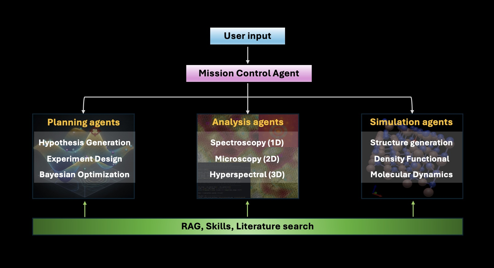
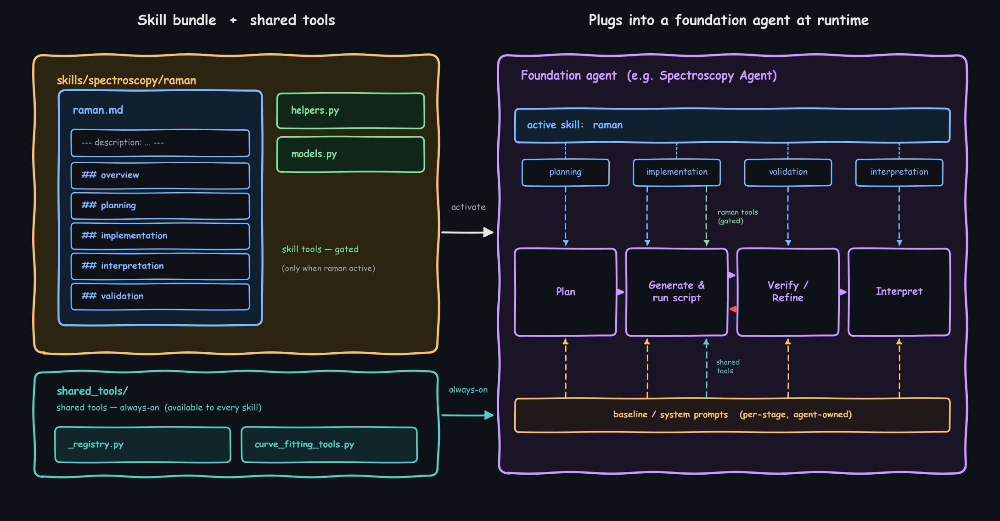
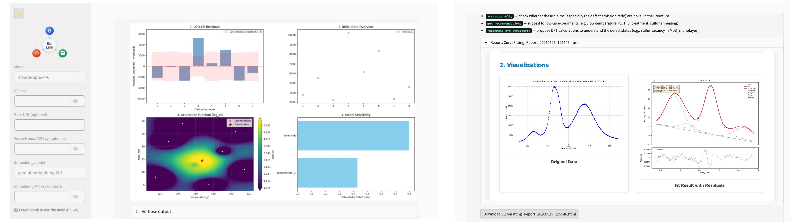

<p align="center">
  
</p>

<!-- Before submitting: confirm the episode number (#7 assumes this is the next entry after 06-AISAC). -->

# 06/05/2026 &mdash; AotW#7: SciLink &mdash; Agentic Automation of the Experimental Discovery Loop

> **SciLink is under active development.** New analysis modalities, simulation backends, and domain skills are continuously being added.

---

## Science Story

A modern characterization experiment produces far more than one specialist can fully exploit.
A microscopy image, a spectrum, or a hyperspectral datacube has to be cleaned, then fit or
segmented, then weighed against what the literature already reports, and only then turned into
the next experiment or a simulation that might explain it. Every step calls for different
expertise and a different tool, and the combined know-how to fit a Raman spectrum, segment a
STEM image, decompose an EELS map, judge what the result means, design a sensible follow-up,
and set up a DFT calculation is almost never held by one person.

**SciLink**, developed at Pacific Northwest National Laboratory, folds that scattered workflow
into one conversation. Hand it raw data and a sentence of context and it returns a checked
analysis; ask for the next round of experiments and it proposes them with Bayesian
optimization and the literature in view; ask it to ground a result and it assembles,
validates, and submits the DFT or molecular-dynamics calculation. Three complementary agent
systems span the loop, and a **Mission Control** agent routes between them so the scientist
doesn't have to:

- **Analyze** — multi-modal experimental data analysis (1D curves & spectra, 2D images, 3D
  datacubes)
- **Plan** — experimental design: hypothesis generation, literature-aware strategy, Bayesian
  optimization
- **Simulate** — computational grounding: structure generation, DFT input preparation
  (VASP / Quantum ESPRESSO), classical MD (LAMMPS), and HPC job orchestration

None of this is bound to a particular instrument or material. One set of foundation-agent
cores serves microscopy, spectroscopy, crystallography, and simulation alike; a new technique
enters as a *skill bundle* — expert guidance plus optional helper code, written in markdown —
that a domain scientist can contribute on their own, without SciLink's internals needing to
change to make room for it.

<p align="center">
  
</p>

---

## Agentic Motivation

The hard part of this loop isn't shuttling files between tools — it's the expert judgment each
step demands. How should this spectrum be fit? Is that segmentation trustworthy, or an
artifact? Does this finding actually differ from what's published? Which experiment is worth
running next? Each is a reasoning problem that has traditionally required a human specialist,
and a plain LLM chatbot can't stand in for one: it can't run the analysis, can't check whether
its own answer is right, and forgets what it learned the moment the session ends.

SciLink's agents are built to *do* this work, not merely route it. Each is a domain specialist
that reasons within its own field — planning an analysis, writing and verifying its own code,
interpreting the result against the literature, and proposing what to try next — and the
architecture is what makes that dependable at scale:

- **Three settled modes, one router:** Every scientific task falls into *analyze*, *plan*,
  or *simulate*. The **Mission Control** agent sits on top as an orchestrator-of-orchestrators
(a meta-agent), routing
  each request to the right specialist based on evidence (it introspects the actual uploaded
  files) rather than keyword heuristics — so the user never switches modes by hand.
- **Foundation agents, not a zoo of one-off agents:** Each analysis modality is covered by a
  single *foundation agent* — `CurveFittingAgent` (1D spectra), `ImageAnalysisAgent` (2D
  images), `HyperspectralAnalysisAgent` (3D datacubes) — that is specialized at runtime to a
  specific technique. New techniques are added as skills, not new agents.
- **Capability growth through skills:** A skill bundle pairs narrative expert guidance
  (organized under a fixed section vocabulary) with optional purpose-built code tools.
  Activating a skill changes both what the agent reads at each pipeline stage and which
  specialized tools it can call — keeping each LLM call focused on the active technique
  instead of every possible tool.
- **Verifier-driven code generation:** For the long tail of techniques, foundation agents
  generate per-task analysis code at runtime, run it in a sandbox, and **verify the result
  before accepting it** — no silent acceptance of plausible-but-wrong output.
- **Constraint annealing:** Inspired by simulated annealing, the analysis pipelines hold
  domain priors strictly at first and relax their strictness only when refinement fails,
  under verifier-driven acceptance — preventing both over-constrained dead-ends and
  unprincipled free-for-alls.
- **Persistent, compounding memory:** When a non-obvious solution recurs, it is *graduated*
  into a reusable skill stored under `~/.scilink` — surviving package upgrades and
  auto-discovered on every future run. Successful hard-won fits auto-distill into provisional
  skills that a human reviews and promotes. The system gets better at a lab's specific
  problems over time.
- **Literature grounding and novelty assessment:** Agents search the literature for context
  and (via an Edison Scientific integration) score experimental findings against prior work,
  flagging genuinely novel claims and recommending validation experiments.
- **Three autonomy levels:** *Co-pilot* (human reviews every step), *autopilot* (AI leads,
  human approves major decisions), and *autonomous* (fully hands-off) — chosen per session.

---

## Implementation

Under the hood, SciLink is a stack of Python agents arranged in layers. A **Mission Control**
agent at the top routes work to three chat-driven orchestrators — one per mode — that share
the same loop machinery: message history, autonomy level, checkpointing, and MCP. Below each
orchestrator, **foundation agents** handle the modality-specific work. Anything a team adds —
skills, tools, whole new agents — attaches to this stack from the outside, and the core is
never edited to take it in.

---

### Agent Architecture

The mode universe is **fixed at three** — analyze, plan, simulate. Capability growth happens
*inside* each mode via skill bundles. The **Mission Control** agent at the top 
keeps one persistent child per mode, reused across delegations so context accumulates,
and threads each result's key findings into the next delegation's context.

**The foundation-agent pattern.** Each analysis-side agent covers one *modality* and is
specialized at runtime to a specific *technique*. A foundation agent carries five elements:

1. A **modality-specific pipeline** (its own sequence of planning → execution →
   verification → refinement stages).
2. **Per-stage baseline prompts** encoding technique-independent reasoning — the agent's
   always-present default expertise.
3. A **fixed section vocabulary** — `overview`, `planning`, `analysis`, `interpretation`,
   `validation`, `implementation` — the contract skill authors write against.
4. **Pluggable skills** that splice their authored sections into the right baseline prompts
   and expose skill-gated tools.
5. An **extensibility loop**: stable specialized tools (e.g. SAM for image segmentation)
   plus runtime code generation, sandboxed and verified.

This is what makes "skills, not new agents" work: adding XRD profile fitting or EPR
spectroscopy means writing a markdown skill for `CurveFittingAgent`, not authoring a new
agent class.

<p align="center">
  
</p>

---

### Skills Subsystem

Skills are how SciLink grows. A skill bundle lives at `scilink/skills/<domain>/<name>/`
as a markdown file (plus optional sibling `.py` tools), authored under the fixed six-section
vocabulary. Skill markdown is **LLM-facing reference**; runnable code lives in sibling `.py`
files registered via `TOOL_SPEC` and is visible to the model only when that skill is active.
Multi-skill loading is end-to-end — `run_analysis` accepts a single skill or a list.

Cross-skill helpers live in `scilink/skills/_shared/` (always-on infrastructure, including
the registry/discovery layer). A domain scientist who writes only markdown can ship a
complete skill as a single `<name>.md` and never touch Python.

**Persistent skill memory.** Skills that an agent *graduates* during a session — recurring
failure modes, non-obvious parameter choices, hard-won fits — are written under `~/.scilink`
(relocatable via `$SCILINK_HOME`), where they survive `pip` upgrades and are auto-discovered
on every run. Successful difficult fits auto-distill into *provisional* skills that stay out
of auto-routing until a human reviews and promotes them. The result is memory that compounds:
SciLink gets measurably better at a specific lab's recurring problems.

```bash
scilink memory list        # show graduated / distilled skills
scilink memory show  <domain>/<name>
scilink memory staged      # raw auto-distilled solutions awaiting review
scilink memory promote <domain>/<name>      # admit a provisional skill to auto-routing
scilink memory consolidate <domain>/<technique>   # merge staged solutions into one skill
scilink memory upgrade <domain>/<id> --into <domain>/<name>
scilink memory prune <domain>/<name>
```

---

### Observability & UI

For most users the **Streamlit web UI** (`scilink ui`; install with `scilink[ui]`) is the
primary way to work with SciLink. It surfaces all three modes through a chat interface with
file upload and metadata entry, a tool/agent registry browser, a **skills manager** (review,
promote, prune graduated skills), simulation and VASP workflow panels with HPC job tracking
and results download, and an MCP connection panel.

<p align="center">
  
</p>
<p align="center"><em>The web UI — left: <strong>plan</strong> mode returning Bayesian-optimization
diagnostics for the next experiments; right: <strong>analyze</strong> mode fitting an uploaded
monolayer-MoS<sub>2</sub> photoluminescence spectrum.</em></p>

In **Mission Control** (the meta-agent mode) it adds a **Telemetry tab** — a local,
introspection-only view of the session. It renders Mission Control's **delegation ledger**
(which specialist handled what, in what order, with which inter-task dependencies), per-agent
**action and tool-call traces** (shown by type signature, not raw values), and the **claims
and reasoning** behind each analysis. Everything is read from session state already on disk —
**no analytics, no external service, nothing leaves the machine.**


---

### Deployment & Extensibility

**Entry points.** Most users work in the **web UI**, which runs all three modes (with Mission
Control routing between them) in a browser. The same capabilities are available from the command line —
convenient for scripting, automation, and headless or HPC runs:

| Command | What it does |
|---|---|
| `scilink ui` | Launch the **web UI** (all three modes, routed by Mission Control) — the primary surface |
| `scilink` / `scilink explore` | Mission Control in the terminal (auto-routes among modes) |
| `scilink analyze` | Analysis orchestrator (`--data`, `--metadata`) |
| `scilink plan` | Planning orchestrator (`--data-dir`, `--knowledge-dir`) |
| `scilink simulate` | Simulation orchestrator (`--request`) |
| `scilink memory …` | Manage graduated / distilled skills |
| `scilink serve` | Run SciLink as an **MCP server** (stdio / SSE) for external clients |

**LLM endpoints — provider-agnostic via LiteLLM.** A single wrapper routes credentials per
provider, with auto-discovery from the conventional vendor environment variables. SciLink currently supports the following providers: Anthropic, OpenAI, Google Gemini, AWS Bedrock, plus any OpenAI-compatible proxy.

**Extending without forking the framework:**
- `--skills ./my_skill.md` — drop in a domain skill bundle (markdown, optionally with sibling tools)
- `--tools ./my_tools.py` — register custom tools (OpenAI-format schemas + factory functions)
- `--agents ./my_agent.py` — register a custom `BaseAnalysisAgent` subclass
- `--mcp …` — connect external MCP servers (e.g. an arXiv search server) as additional tools
- `scilink serve` — expose SciLink's own tools to MCP clients (Claude Desktop, Cursor, IDEs)

**SciLink as a platform.** Extensibility is the entire point of the foundation-agent + skills
design. A new domain, technique, or method shows up as a skill bundle attached to
whichever agent already fits the work — no fork, no second copy of the framework to maintain,
every project riding the same upstream core. The split of responsibilities is clean: a domain
scientist supplies the expertise as markdown, and an engineer writes a helper tool only when
prose alone can't express what the task needs.

---

## To Know More

### Source Code
- **Repository:** https://github.com/ziatdinovmax/SciLink
- **Install:** `pip install scilink` &nbsp;(`scilink[sim]`, `scilink[ui]` for optional features)
- **License:** MIT

### Selected Publications

SciLink is the engine behind published, real-world materials research.

**Critical-materials recovery (2026).** Ritchhart, A., Allec, S. I., Butreddy, P., Kulesa, K.,
Wang, Q., Nguyen, D. T., Ziatdinov, M., & Nakouzi, E. *Agentic workflow enables the recovery
of critical materials from complex feedstocks via selective precipitation.* **Materials
Horizons** (2026). [doi:10.1039/D6MH00475J](https://pubs.rsc.org/en/content/articlelanding/2026/mh/d6mh00475j)

This work builds **CICERO** (Computer Intelligence for Critical Elements Recovery and
Optimization) on SciLink's **planning subsystem**, running a six-stage closed loop —
*Diagnose → Evaluate → Hypothesize → Experiment → Characterize → Refine*. SciLink's Planning
Agent ingests domain literature and ICP-MS feedstock data through its retrieval-augmented
pipeline, runs an economic-viability screen that filters the hypothesis space *before* any
experiment, and emits both testable separation hypotheses and actionable Opentrons Python
protocols; the Bayesian-optimization agent then drives budget-aware, constraint-handling
optimization over 96-well-plate experiments. Demonstrated on three real feedstocks —
oil-and-gas produced water (**99.4% pure Mg(OH)₂ at 86% yield**), leached SmCo magnets
(**85% Sm purity, separation factor ~22.8**, improved in a second BO-guided round), and
leached NdFeB magnets — it compresses separations development from months or years to
**days**: a live, end-to-end demonstration of *plan* mode.

**The original SciLink (2025).** Yao, L., Samantray, S., Ghosh, A., Roccapriore, K.,
Kovarik, L., Allec, S., & Ziatdinov, M. *Operationalizing Serendipity: Multi-Agent AI
Workflows for Enhanced Materials Characterization with Theory-in-the-Loop.*
[arXiv:2508.06569](https://arxiv.org/abs/2508.06569) (2025).

The founding paper introduced SciLink as a hybrid system pairing specialized ML models for
quantitative analysis of experimental data with LLMs for higher-level reasoning — turning
raw atomic-resolution microscopy and hyperspectral data into testable scientific claims,
scoring those claims for novelty against the published literature, and linking them to
theoretical simulations with a human expert in the loop. It describes an **earlier
generation** of SciLink, predating the three-mode/Mission-Control architecture, the
foundation-agent pattern, and the persistent-skill memory described above, but remains the
best reference for the project's founding motivation: systematically analyzing *all*
observations to cultivate serendipitous discovery, rather than only chasing a pre-set
hypothesis.

### Contact
- **Maxim Ziatdinov** &mdash; maxim.ziatdinov@pnnl.gov

---

*Last Updated: June 2026*  
*Contributed by: Maxim Ziatdinov*
