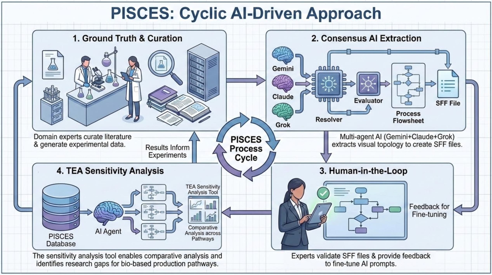
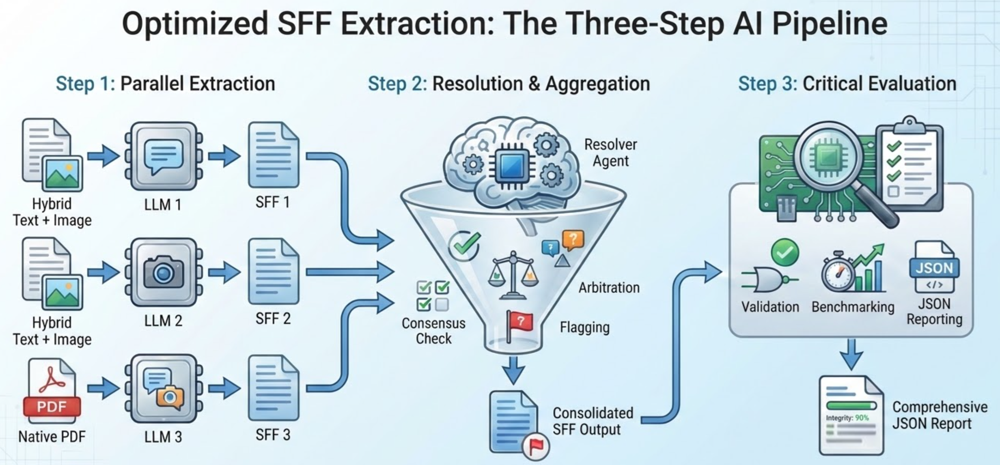

  

# 06/22/2026 &mdash; AotW#8: PISCES &mdash; Multi-Model Consensus Extraction of Biochemical Process Flowsheets

---

## Science Story

Designing economically viable biomanufacturing processes requires learning from dozens of published chemical process flowsheets — each buried inside a PDF with its own notation, unit system, and visual layout. Valuable information is buried in diagrams, text, and tables. Technoeconomic Analysis (TEA) depends on this data, but extracting it manually is a weeks-long task even for experienced process engineers. A single paper may describe a fermentation process and a series of separation and purification steps across five pages of text and one dense Process Flow Diagram (PFD). The researcher must reconcile all of this fragmented data and reconstruct the process model in a machine-readable format before performing rigorous quantitative analyses.

**PISCES** (Process Information from Chemical and Engineering Sources), developed at Lawrence Berkeley National Laboratory and the Joint BioEnergy Institute, automates this pipeline entirely. Feed it a scientific PDF and it returns a validated, machine-readable **Standard Flowsheet Format (SFF) JSON**, complete with unit operations, stream topology, chemical identities, flow rates, and operating conditions. When the source paper also reports technoeconomic data, PISCES’s integrated TEA sensitivity analysis tool can operate directly on the extracted flowsheet, enabling rapid comparative analysis across hundreds of published pathways. PISCES is designed to build the large-scale process databases needed for comparative analysis of bio-based production pathways and systematic identification of key research gaps and opportunities, directly supporting LBNL's mission to address national-scale challenges with biomanufacturing and biodesign.

  

---

## Agentic Motivation

Extracting a process flowsheet from a scientific paper is not a trivial task. It is a multi-step reasoning problem that involves document layout analysis, diagram interpretation, unit reconciliation, and cross-field consistency checking. A single LLM call or a simple OCR pipeline reliably fails on the ambiguities that appear in real literature. PISCES addresses this through a **consensus architecture** that turns model disagreement from a hidden failure into an explicit, auditable signal:

- **Diversity through model heterogeneity:** Three Extractor Agents, built on heterogeneous VLMs such as Gemini, Claude, and Grok, independently parse the same document using different hybrid input strategies (native-PDF versus text-plus-image rendering), so no single model's blind spots dominate the output.
- **Diagram-first routing:** Lightweight **Scout** agents identify distinct process scenarios, locate PFD candidates, score them for relevance, and map each scenario to its corresponding diagram, and stitch figures together when a single PFD spans multiple pages, before any heavy extraction begins. 
- **Provenance-tracked extraction:** Every extracted data point is tagged with its exact source location (page, section, table or diagram, and text snippet) and its extraction method (verbatim, calculated, or inferred), so downstream reviewers can always trace a value back to its origin.
- **Resolver-driven consensus:** A **Resolver Agent** merges the three extractions field by field, normalizing units and naming conventions, promoting values where agents agree, and flagging disagreements with a confidence level based on the degree of consensus for downstream handling.
- **Logic-audited output:** An **Evaluator Agent** performs a final consistency pass (every unit must have at least one input and output stream except feedstock or products; mass balances must be internally plausible), assigns per-field confidence scores, and benchmarks individual model performance to inform future model selection.
- **Human-in-the-loop escalation:** Low- and medium-confidence records are automatically routed to a validation UI for expert review before database insertion, preserving automation speed while ensuring data quality on hard cases. Expert corrections can also feed back into prompt refinement.

  

---

## Implementation

PISCES is implemented as a modular **Python AsyncIO pipeline** deployed as a containerized service backed by LBNL’s CBORG platform (`api.cborg.lbl.gov`). The pipeline executes sequentially per document by stage:

1. **Semantic ingestion** — a smart PDF processor ingests the main manuscript and any supplemental information (SI) files simultaneously, converting them into semantic markdown so that textual operating conditions (temperatures, pH, flow rates) from body text and tables share a single context window with the diagrams.
2. **Scenario identification and visual routing** - scout agents identify distinct process scenarios, locate and score PFD candidates, and map each scenario to its corresponding diagram, stitching multi-page figures where needed. 
3. **Parallel Extractors** — heterogeneous VLMs (e.g., Gemini 3.1 Pro, Claude 4.6 Sonnet, and Grok 4) each reconstruct the process as a directed graph of nodes and edges, linking topology to textual parameters and producing an independent SFF JSON candidate; a `json_repair` middleware step corrects truncated or malformed LLM output.
4. **Resolver** — merges the three candidates using field-level consensus logic; normalizes units and naming, resolves disagreements, assigns confidence level, and preserves all alternative values with their provenance for later audit.
5. **Evaluator** — validates the merged SFF for stream connectivity, emits a confidence score, and produces a JSON report on data integrity and per-model contribution.
6. **HITL Gateway** — confident records are inserted into the process database; records below threshold go to a Next.js frontend web application.

The workflow is stateless per document, enabling horizontal scaling. Pydantic schema validation is enforced throughout to ensure that every SFF output conforms to a fixed, versioned schema regardless of which model produced which field.

---

## To Know More

### Source Code
- **Repository:** Currently private (LBNL internal); flowsheet extraction tool publicly available at https://projectpisces.org/ 
- **License:** Lawrence Berkeley National Labs BSD variant license (SPDX: BSD-3-Clause-LBNL)

### Additional Resources
- **Website:** https://projectpisces.org/
- **Contact:** Yuting Chen — yutingchen@lbl.gov
- **Contact:** Tyler Huntington — tylerhuntington222@lbl.gov
- **Contact:** Corinne Scown — cdscown@lbl.gov

---

*Last Updated: 06/22/2026*
*Contributed by: Yuting Chen, Tyler Huntington, Corinne Scown, Meili Gong, Sarang Bhagwat — Lawrence Berkeley National Laboratory*

